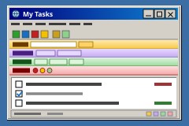

  

# Todo Explorer

  

Didn't work? Create a Minds workspace and paste this to your agent:
` /use-template https://github.com/danielmewes/parody-todo-explorer`

## Why you care

Seventy-seven controls. Ten toolbars.

Due dates, urgency, notes, categories, several lists, search across all of
them, archiving, undo, a recoverable deleted pile, focus mode, import, export,
print.

## How to use it

Open the **To-Do List** tab.

Type a task. Press Enter. Tick the box to finish it. Del removes it.

| Menu | Holds |
| --- | --- |
| **File** | Lists, import, export (`.txt`, `.json`, `.html`), e-mail, print, offline |
| **Edit** | Undo, redo, cut, copy, paste, rename, find, find-and-replace |
| **View** | Toolbars, side panel, text size, seven sort orders, three groupings, stored data |
| **Favourites** | Star, organise, jump |
| **Tools** | Template packs, archive, de-duplicate, restore deleted, pop-up blocker, add-ons, options |
| **Help** | Index, tip of the day, toolbar guide, shortcuts, About |

Seven specialist toolbars:

- **TaskFinder** searches this list, highlights matches.
- **FindItAll Search Suite** searches every list, notes included.
- **Chore Genie!** ready-worded jobs from five template packs.
- **DeadlineBar Pro** due dates in one click.
- **PriorityPal 2000** urgency markers, and Panic Mode.
- **WeatherTask 2000** matches jobs to the weather.
- **ShopSmart$aver** shopping list inside your task list.

Focus mode shows one task.

Developer notes:
[`system/apps/todo_list/README.md`](system/apps/todo_list/README.md).

## Ideas for making it yours

- **An eighth toolbar.** A key in `ADDON_KEYS`, a strip in `index.html`, a
  colour in `app.css`, a handler in `app.js`.
- **A new assistant.** Its lines are strings in `app.js`; its glyph is one
  symbol in `index.html`.
- **Your own prompts.** `TIPS_OF_THE_DAY` and `GENIE_TIPS`.
- **A wall display.** Focus mode, narrow column, toolbars hidden.
- **Work and Home side by side.** Register a second instance.

## What this is

A published **minds template**: a bootable snapshot, ready to adapt.

[`template.md`](template.md) is the manifest, including what you must decide.
[`template.toml`](template.toml) is its machine-readable half.
